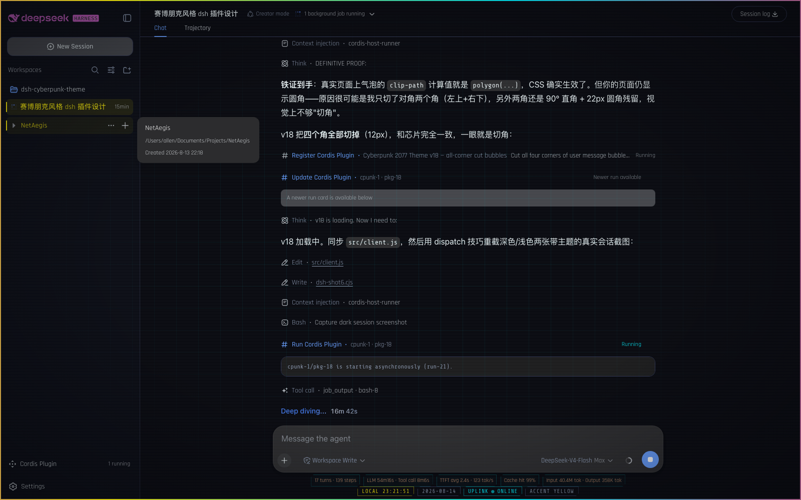
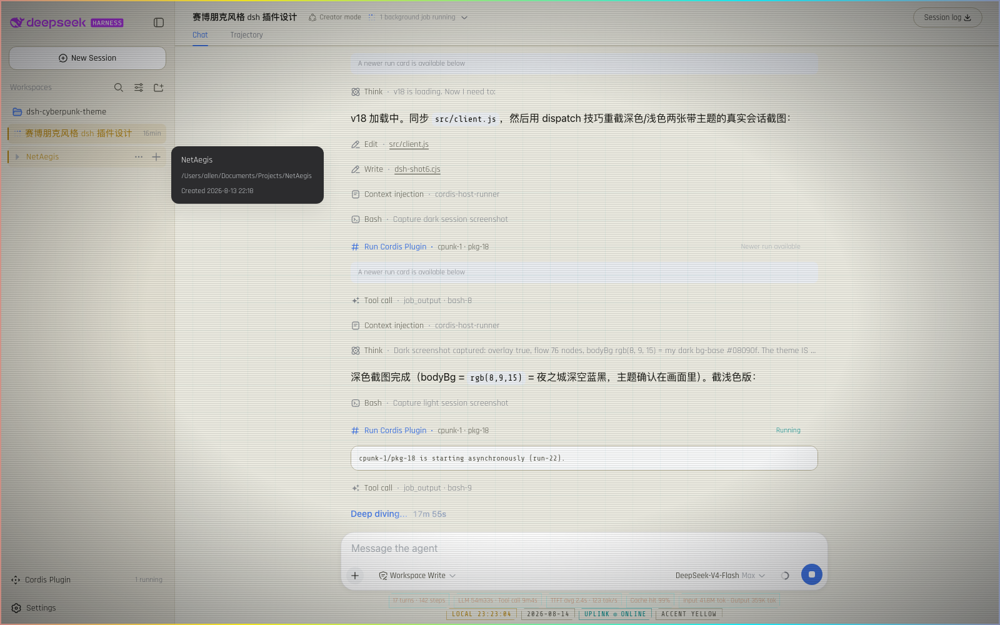

# DSH Cyberpunk 2077 Theme

> A deep **Cyberpunk 2077 / Night City** reskin for
> [DeepSeek Harness](https://github.com/deepseek-ai) (DSH), shipped as a
> **dynamic Cordis plugin**. Neon palette, CRT atmosphere, flowing brand,
> live status readout — with an in-app settings page.

中文简介：把 DeepSeek Harness 整体换成《赛博朋克 2077》夜之城风格的动态 Cordis 插件——霓虹配色 + 线框网格/扫描线/暗角/边框流动彩带/故障闪烁 + 品牌多色流动 + composer 下方实时状态条（时间 / 日期 / UPLINK 心跳 / 强调色），并带设置页：配色方案切换、4 套强调色、4 个特效开关。

---

## Screenshots

| 🌃 Night City (dark) | 🏙 Arasaka (light) |
| --- | --- |
|  |  |

*(Captured from a live DSH session with the plugin active — dark mode shows the full neon look.)*

---

## Features

### 🎨 Palette
- **Dark mode — Night City**: blue-black `#08090f` canvas with neon yellow
  `#fcee0a` accents, electric cyan `#00f0ff`, magenta `#ff2d6b`.
- **Light mode — Arasaka**: warm paper `#edece2` with gold/red accents,
  readable but clearly themed.
- 4 accent presets (Night City Yellow / Netrunner Cyan / Trauma Team Magenta /
  Arasaka Gold), each with tuned light+dark pairs.

### 🌆 Atmosphere (all click-through, `pointer-events: none`)
- **Night City wireframe grid** — faint cyan grid, center-focused, fading at
  the edges.
- **CRT scanlines** — adaptive to the color scheme (dark lines on light,
  light lines on dark).
- **Vignette** — soft corner darkening.
- **Flowing frame ribbon** — a 2px neon ribbon (yellow → cyan → magenta →
  purple) flowing around the whole app border.
- **Screen glitch** — occasional full-screen glitch burst.

### ✨ Brand
- The top-left **DeepSeek Harness wordmark + whale logo** flow through the
  four-color palette (8s cycle) with periodic RGB-split glitch.

### 📊 Composer readout
- **LLM stats line** — the shipped stats line becomes compact one-line
  cut-corner chips whose color **syncs live with the brand** (same keyframes),
  with a soft glow and a rare subtle glitch.
- **Status strip** — `LOCAL HH:MM:SS` · date · `UPLINK ● ONLINE` heartbeat
  (real Client→Host ping, pulsing dot) · current accent; optional glitch
  flicker.

### 🧩 Deep touches
- **Cyberpunk diagonal two-corner cuts** (top-left + bottom-right, the
  CP2077 signature) on **user bubbles** (16px), **tool-call group cards**
  (14px), **composer card** (12px), **New Session button** (10px) and
  **code blocks** (10px) — every cut edge gets a neon line (the 1px border
  is clipped along the diagonal, so the cut line itself glows).
- **Sidebar rows** — persistent neon rail on the active session
  (`aria-selected`), neon hover tint + accent text on every row.
- **Neon caret** and **neon focus glow** on text inputs; HUD heading spacing;
  terminal accent bar on code blocks; neon scrollbar & selection.

### ⚙️ Settings page (`Settings → Cyberpunk 2077`)
- Color scheme: **Night City (Dark)** / System / Light.
- Accent: 4 presets, applied live via `theme.overrideTokens`.
- Toggles: **Grid**, **Scanlines**, **Screen glitch**, **Status glitch**.
- Everything respects `prefers-reduced-motion`.

---

## Requirements

- DeepSeek Harness with the **dynamic Cordis plugin** feature
  (`cordis_define` / `cordis_run` flow).
- A modern browser: `color-mix()` (Chrome 111+, Safari 16.2+, Firefox 113+)
  and `:has()` (Chrome 105+, Safari 15.4+, Firefox 121+). Unsupported
  browsers degrade gracefully (no glow/grid, still themed).
- Internet access for Google Fonts (Rajdhani / Chakra Petch / Share Tech
  Mono); falls back to system fonts offline.

---

## Installation

This is a **dynamic Cordis plugin** — the runtime extension feature of DSH.
The repo's `src/client.js` and `src/host.js` are the exact plain-JavaScript
"function body" forms the feature accepts.

1. Open DSH in a browser and start the **dynamic-plugin** flow.
2. Create a new plugin with any 3–6 letter `idPrefix` (e.g. `cpunk`).
3. Paste the `return { … }` block from
   [`src/client.js`](./src/client.js) as the **client** code, and the
   `return { … }` block from [`src/host.js`](./src/host.js) as the **host**
   code.
4. Run it and approve the activation.

> 💡 Best in **dark mode**: Settings → Cyberpunk 2077 → **Night City (Dark)**,
> or the built-in Appearance setting.

### ⚠️ How dynamic plugins behave

- The client half loads when the page receives a **dispatch** (a
  `cordis_run` / `cordis_update`, or pressing a run card's start control).
- **Refreshing the page clears the client half** — the theme returns on the
  next dispatch (re-run the plugin). This is by design of the dynamic-plugin
  runtime.
- The plugin is process-scoped: it does **not** persist across a DSH
  restart.

### Porting to a permanent plugin

To ship it as a persistent composition plugin (mounts via `cordis.yml`,
survives restarts), replace the three dynamic conveniences:

| Dynamic API | Permanent plugin equivalent |
| --- | --- |
| `styles.insert(css)` | bundler CSS (CSS modules / stylesheet import) |
| `React.createElement(...)` | JSX |
| `harness.handle` / `host.call` ping | your regular client↔host bridge |

Everything else — `theme.overrideTokens`, slot registrations
(`shell.overlay`, `conversation.composer.dock`, `settings.section`), token
names, palette values — carries over unchanged.

---

## Customization

All knobs live in [`src/client.js`](./src/client.js):

- **`ACCENTS`** — accent presets; add one by giving it `label` +
  `{ light, dark }` pairs for `brand` / `success` / `error` / `warn`.
- **`baseTokens`** — accent-independent background/text/border tokens,
  each a `{ light, dark }` pair (the 13 DSH alias tokens).
- **`MAIN_CSS`** — every effect; durations are the `…s infinite` values in
  the `@keyframes` (`cp-ribbon`, `cp-brand`, `cp-glitch`,
  `cp-stats-glitch`, `cp-status-glitch`, `cp-dot`), intensities are the
  alpha/`color-mix` percentages.

---

## How it works

- **Tokens**: `theme.overrideTokens(source, tokens)` stacks a layer over the
  active theme — the presenter projects it onto `body` as inline CSS
  variables, so both light and dark palettes get full overrides.
- **Slots**: the overlay is registered in `shell.overlay` (list, additive),
  the status strip in `conversation.composer.dock`, the settings page in
  `settings.section`.
- **Product DOM targeting**: shipped UI is styled through *stable
  attributes* instead of hashed classes:
  - user bubbles: `data-chat-flow-kind="user"` + `data-time-hover-root`
    (the last `div` child of the row stack is the bubble itself)
  - tool-call groups: the `data-chat-flow-kind="tool-call"` seat becomes
    the visible cut-corner card (rows inside are chrome-free by design)
  - sidebar rows: `role="treeitem"`, `aria-selected="true"`
  - composer card: `data-composer-card` — the cut-corner frame is drawn on a
    `::before` pseudo-element layer (card fill + neon border + glow are all
    clipped there). **Never clip-path the card itself**: the model selector
    and reasoning-effort menus render inside the card's overlay anchor, and a
    `clip-path` on an ancestor hard-clips its descendants — they cannot
    escape, not even with `position: fixed`. This broke model switching and
    effort selection in v22; the pseudo-element approach keeps both the cut
    look and fully functional menus.
  - New Session button: `[data-slot="sidebar"] > div > button:has(> svg[viewBox="0 0 16 16"][width="14"])`
    — the sidebar root's direct button child with the 14×14 plus icon. The
    brand wordmark button (216×24, *fully* filled by the wordmark svg) is
    deliberately left uncut — clipping it would clip the brand glyphs
  - code blocks: `[data-chat-flow-kind] pre`
  - brand: `svg[viewBox="0 0 182 24"]` / `svg[viewBox="0 0 23.16 17.04"]`
  - LLM stats line: sibling-of-status-strip via `:has(+ .cp-status)`

  These are not part of DSH's public API — if DSH changes its DOM structure
  they degrade gracefully (no errors, just un-styled regions).

---

## Project structure

```
dsh-cyberpunk-theme/
├── src/
│   ├── client.js     # client half: tokens, CSS, overlay, status strip, settings
│   └── host.js       # host half: package-private `ping` RPC (heartbeat)
├── index.js          # re-exports both plugin factories
├── docs/
│   └── screenshots/  # dark & light captures
├── package.json
├── LICENSE           # MIT
└── README.md
```

---

## License

[MIT](./LICENSE)
